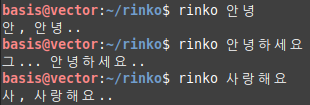

# rinkotranslator  
린, 린코 번역기, 예요...  
  

  
basis@vector:~/rinko$ rinko 안녕  
안, 안녕..  
basis@vector:~/rinko$ rinko 안녕하세요  
그... 안녕하세요..  
basis@vector:~/rinko$ rinko 사랑해요  
사, 사랑해요..  
basis@vector:~/rinko$ rinko 분명 우리는 아무리 연습을 해도 음은 맞지 않을 거예요  
분명 우리는 그... 아무리.. 연습을 해도 음은 맞지, 않을 거예요,  
basis@vector:~/rinko$ rinko 이런 연주는 아무도 들으려 하지 않아요  
이, 이런.. 연, 연주는.. 아무도 들으려.. 하지 않아요,  
basis@vector:~/rinko$ rinko 왜냐하면 누구도 모두의 소리를 들으려 하지 않으니까요  
그... 왜냐하면.. 누구도 모두의, 소, 소리를.. 들으려, 하지 않, 않으니까요..  
  
분명 우리는 그... 아무리.. 연습을 해도 음은 맞지, 않을 거예요,  
이, 이런.. 연, 연주는.. 아무도 들으려.. 하지 않아요,  
그... 왜냐하면.. 누구도 모두의, 소, 소리를.. 들으려, 하지 않, 않으니까요..  
